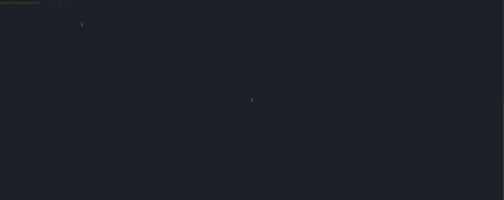
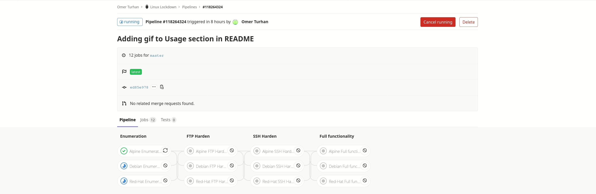

[](https://gitlab.com/Omer.Tech/LinuxLockdown/commits/master)

<!-- PROJECT LOGO -->
<br />
<p align="center">
  <a href="https://gitlab.com/Omer.Tech/LinuxLockdown">
    
  </a>

  <h3 align="center">Linux Lockdown</h3>

  <p align="center">
    Lock down your Linux system today
    <br />
    <br />
    <a href="https://gitlab.com/Omer.Tech/LinuxLockdown/issues">Report Bug</a>
    ·
    <a href="https://gitlab.com/Omer.Tech/LinuxLockdown/issues">Request Feature</a>
    ·
    <a href="https://gitlab.com/Omer.Tech/LinuxLockdown/pulls">Send a Pull Request</a>
  </p>
</p>


<!-- TABLE OF CONTENTS -->
## Table of Contents

* [About the Project](#about-the-project)
  * [Built With](#built-with)
* [Getting Started](#getting-started)
  * [Prerequisites](#prerequisites)
  * [Installation](#installation)
* [Usage](#usage)
* [Roadmap](#roadmap)
* [Contributing](#contributing)
* [License](#license)
* [Contact](#contact)
* [Acknowledgements](#acknowledgements)


<!-- ABOUT THE PROJECT -->
## About The Project


I originally started this project to automate some Linux hardening tasks for my school's  
Cybersecurity team. We have started using this script during our blue-team competitions to  
help free up our Linux administrators to help with other tasks.  

This shell script can:
* Install and configure Very Secure FTP (vsftp) to handle any FTP connections.  
* Configure SSH with either a key-based or password-based authentication, based on the user's choice.  
* Install Uncomplicated Firewall (ufw).
* Configure firewall to allow previously configured services through.  
* Confiire firewall to drop all other connections, or add other exceptions if desired.  
* Generates enumeration report of machine to ./report.txt  
* Generates log report of what the script accomplished to ./log.txt  
  
Of course, this script will not protect against all threats, and will not completely secure your machine. This script should be used as a tool to help automate some simple security tasks, and should not be seen as an all-in-one solution for your Linux security needs.  
  
A list of commonly used resources that I find helpful are listed in the acknowledgements.

### Built With
This script was completely written in Bash, however I also used Gitlab's CI/CD to create a pipeline and test this code automatically every time I create a new commit, or accept a new merge request. If you are not viewing this on Gitlab, you may not be able to see it. Make sure to check out https://gitlab.com/Omer.Tech/LinuxLockdown and navigate to the .gitlab-ci.yml file.
* [GNU Bash](https://www.gnu.org/software/bash/)
* [Gitlab CI/CD](https://docs.gitlab.com/ee/ci/)


<!-- GETTING STARTED -->
## Getting Started

If you know of services that have to be run on this system, it would help to research which ports  
they need to use. This script will ask you which ports you wish to allow through the firewall,  
and the script will deny any other ports from getting through.  

### Prerequisites

If your system does not use one of the listed package managers, please download one before using this script.  

* Must be ran on a Linux system.
* Must use either apt, rpm, or apk package managers.  
* Must be ran as root or as an account that has root privileges.  

### Installation

1. Clone the repo  
```sh
git clone https://gitlab.com/Omer.Tech/LinuxLockdown.git
```
2. Set file permissions  
```sh
chmod +x -R ./LinuxLockdown
```
3. Execute script
```sh
cd LinuxLockdown
sudo ./lockdown.sh
```
4. View Enumeration Report and Log report  
```sh  
cat report.txt  
cat log.txt  
```

<!-- USAGE EXAMPLES -->
## Usage

This script has many different options to choose from, giving the user a lot of flexibility in how they choose to secure their system, and which services they want to secure and allow through the firewall.  
  
  
  
This is how the Gitlab CI/CD Pipeline is set up. Every time a code change is detected, the script will create fresh containers using Alpine, Debian, and Red-Hat based images. Then, there are a series of tests written to confirm the functionality of the Enumeration Report, FTP Hardening, SSH Hardening, and a stage to test full functionality with all settings applied.  
  
  
  
<!-- ROADMAP -->
## Roadmap

See the [open issues](https://gitlab.com/Omer.Tech/LinuxLockdown/issues) for a list of proposed features (and known issues).


<!-- CONTRIBUTING -->
## Contributing

Contributions are what make the open source community such an amazing place to be learn, inspire, and create. Any contributions you make are **extremely appreciated**.

1. Fork the Project
2. Create your Feature Branch (`git checkout -b feature/AmazingFeature`)
3. Commit your Changes (`git commit -m 'Add some AmazingFeature'`)
4. Push to the Branch (`git push origin feature/AmazingFeature`)
5. Open a Pull Request


<!-- LICENSE -->
## License

Distributed under the MIT License. See `LICENSE` for more information.  


<!-- CONTACT -->
## Contact

Omer Turhan - [my website](https://omer.tech) - omer.turhan@outlook.com

Project Link: [https://gitlab.com/Omer.Tech/LinuxLockdown](https://gitlab.com/Omer.Tech/LinuxLockdown)


<!-- ACKNOWLEDGEMENTS -->
## Acknowledgements
* [Roshanlam/ReadMeTemplate](https://github.com/roshanlam/ReadMeTemplate/) 